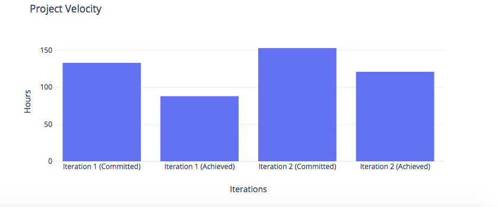

# COMP 3350 - Software Engineering
## Group 15
### Project Retrospective

***

A part of the project our group was unsatisfied with was time management. In iteration 0 and iteration 1, we managed to comfortably finish work around 4 days before the due date. However, for iteration 2 we finished our release on the day it was due. It was surprising to see our team working against the clock when in previous iterations this had not been a concern. Leaving work until the end leads to buggy releases, acquiring technical debt and a greater chance of code smells in our work. We have concluded that what lead to a rushed iteration 2 release was the lack of meetings and updates at the early stages of the iteration. Meetings started during the last two weeks of the iteration, which slowed down our work considerably. For iteration 3, we plan to go back to our meeting procedure during iteration 1, plus other new measures to ensure a timely release.

To ensure a smooth iteration 3 release we plan to increase communication in the team. We plan to have bi-weekly in person meetings (at the minimum). The meetings will happen from the early stages of the iteration and will continue until the due date without pause. The team will also experiment with having daily "Slack stand-up meetings" where we will update all of the members on what we have been working on and if there is any obstacle in our way. The team is also encouraged to use the #repo channel (where Gitlab sends notifications of changes to the master branch) to review other team members' contribution. This will help decrease code smells and will reduce amount of bugs caused when people work out of their "areas of expertise"; but most importantly it will foster ownership and responsibility for every addition to master.

The team would consider this a successful improvement if:  bi-weekly meetings are sustained, at least 5 "Slack stand-up meetings" are held each week and most importantly, if the release for iteration 3 is finished at least two days before the due date. In addition to an early release, the release must adhere to the highest requirements established in the rubric.  

