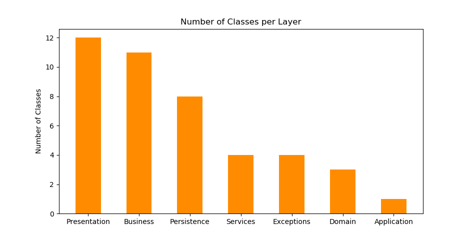
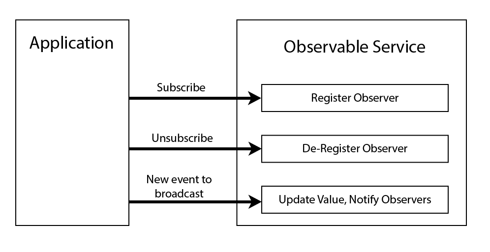
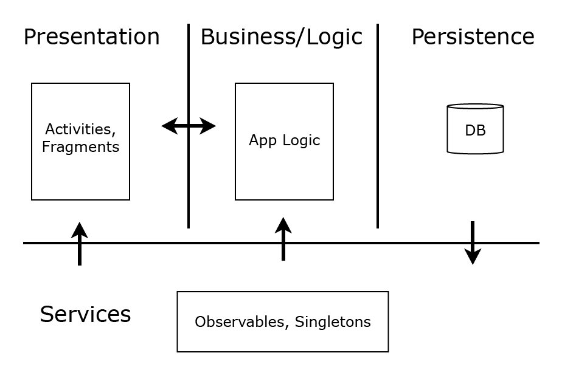

# Development Postmortem Report

## Ensure that you discuss the area you identified for improvement after your iteration 2 retrospective; how did it go? (Raven)

An area of improvement that was identified after iteration 2 was increasing the communication with the team. In iteration 3, the team was successful in doing this by having no less than 2 in-person meetings outside class hours.
The team was also able to practice the "Slack stand-up meetings" to keep everyone updated with their progress and ask for help in the obstacles they encountered. The #repository channel in the team's Slack group was a huge help
do keep track of changes done in master and inspect the changes closely for better understanding of the changes that have been pushed. As what has been reflected on and planned after iteration 2, the overall communication of the
team has improved a lot and this has definitely helped with the progress of the project.

## Question 2: What would you do differently, if you had the chance to start over?

If the team had the chance to start over, the team would use their time more efficiently. The team would also improve a lot on their communication and have as much in-person meetings
as possible given the time they have. The team would utilize communication software (in this instance, Slack) more efficiently and make reports every regular intervals so everyone is on track with the
changes that are being made in the project. The team will not put the project on hold until the last 2 weeks before an iteration is due; the team will start an iteration as soon as they are available to. The team will also
utilize GitLab to better issue discovered bugs and to better work on existing bugs. Up until the third iteration, the group held discussions about bugs only on Slack and live meetings. Using GitLab will make keeping track of bugs easier and
more efficient because there are features in GitLab that will be helpful in notifying other team members when one member finds a bug.

## How large is the project?

The main application has a total of 43 java classes (not including tests). They are each dedicated to the following purpose:

- 1 / 40 classes (2.5%) are Android Application classes.
- 12 / 40 classes (30%) are for the presentation layer
- 11 / 40 classes (27.5%) are for the business layer and all the related observables
- 8 / 40 classes (20%) are for the persistence layer
- 4 / 40 classes (10%) are for the services layer
- 3 / 40 classes (7.5%) are domain models
- 4 / 40 classes (10%) are exception classes

The following bar chart shows the number of classes per application component visually.

## Application Design: Brilliant Decisions & Remaining Smells

One of our better design decisions was the choice to use Java `Observables` for component communication. We have a service that controls subscribing and unsubscribing to various events, which allows subscriptions to events to be done on a per-component basis. This reduces coupling by reducing the amount of communication that happens directly between components. The observables we use are for:

- Notifying when parental control mode status changes.
- Notifying status changes for shuffle and repeat mode.
- Notifying when the database has updated.
- Notifying when the song playing changes.

One design smell we would like to see fixed in the future is to reduce the numbers of song lists in the app to only one. Several of the fragments use their own copy of the song list, which has made updating the song list when it changes a bit messy.

## System Architecture

We were told to use a 3-layer MVC architecture for this project (Presentation, Logic, Persistence). While we did end up using this architecture, we added another layer that all of the other layers communicate with. This is the _Services_ layer. The _services_ layer is concerned with supplying application-wide singletons, and for handling observables, as mentioned above. A typical use of the _services_ layer would be the presentation layer asking for a persistence object so that it can get all of the songs from the persistence layer. While we could have handled this in the logic layer, the sample project we were given took this approach, and we ended up going along with it.

## Future Improvements

Due to issues with the system tests, we were unable to get Audio Focus working. Audio Focus is where our app stops playing music when another app wants to play sound. We did get it working for Iteration 3 but it was causing errors with the system tests, so we eventually had to remove it.

A few other things we would like to see in a future version of our app are:

- A notification bar player for our app so that users can control music playback outside of our app.
- An album and artist view rather than just a song view.
- A more modern UI design.

## Conclusions

